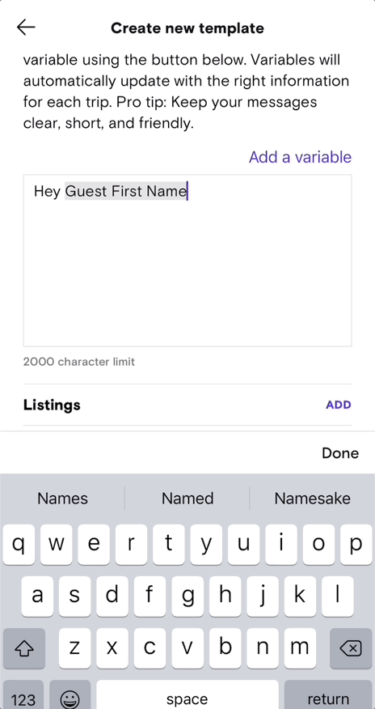
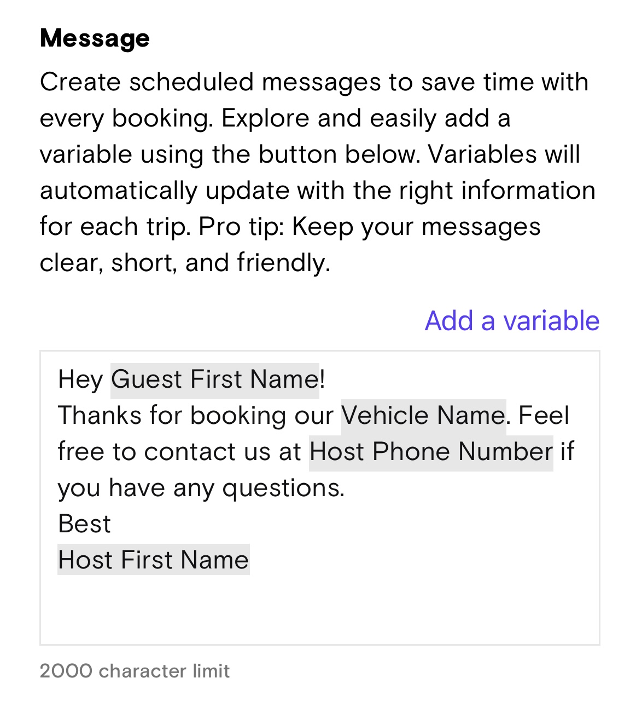
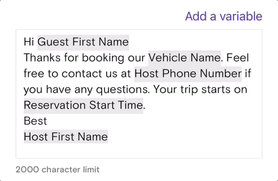
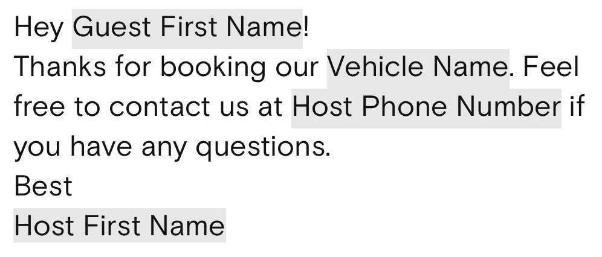
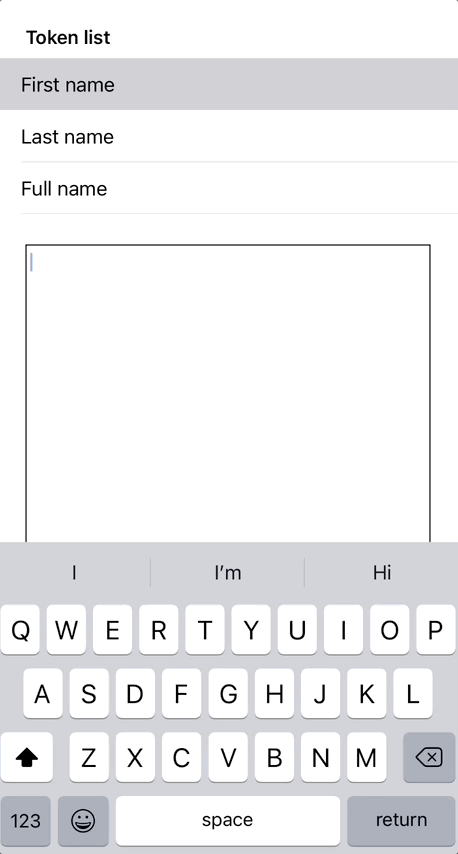

# TokenTextView

TokenTextView is a lightweight UITextView class for editing & managing tokenized text.

Generates and renders templates using token syntax ([mustache](https://mustache.github.io/mustache.5.html) by default)

## Features

### Insert a token into the text



### Create templated or tokenized text



to:

> Hey {{GUEST_NAME}}!\nThanks for booking our {{VEHICLE_NAME}}. Feel free to contact us at {{HOST_PHONE_NUMBER}} if you have any questions.\nBest\n{{HOST_FIRST_NAME}}

and vice-versa.

### Cut/copy & paste tokens



## Requirements

- iOS 11.0+
- Xcode 14.0+

## Installation

TokenUI can be installed via [CocoaPods](https://cocoapods.org)

### CocoaPods

Add the following line to your Podfile:

```
pod 'TokenTextView'
```

Then install TokenTextView:

```
pod install
```

## Setup

### init

TokenTextView is a subclass of `UITextView`, so you can declare it like a normal `UIKit` object in either code or via Storyboard:

```
let tokenTextView = TokenTextView()
```

or

```
@IBOutlet var tokenTextView: TokenTextView!
```

TokenTextView has the following initializer:

```
init(messageText: String, tokens: [Token], tokenOpen: String, tokenClose: String)
```

TokenTextView needs to be initialized with `Token` objects before it can tokenize text. You can do this during object initialization or set them later:

```
let tokenArray = [Token]()
let tokenTextView = TokenTextView(tokens: tokenArray)
```

or

```
let tokenTextView = TokenTextView()
let tokenArray = [Token]()

tokenTextView.tokens = tokenArray
```

TokenTextView can turn tokenized text into text templates and vice-versa. In order to do so, it uses identifiers to designate tokens. It's set up to use "mustache" syntax as the default:

> {{TOKEN_IDENTIFIER}}

You can use custom identifiers by passing in `tokenOpen` and `tokenClose` parameters during initialization:

```
let tokenTextView = TokenTextView(tokenOpen: "{{", tokenClose: "}}")
```

## Usage

### Insert a token

You can insert a token to TokenTextView's text by using the following method:

```
insert(_ token: Token, at insertRange: NSRange? = nil)
```

You can specify the location to insert the token:

```
let token = Token(name: "Token name", identifier: "TOKEN_IDENTIFIER")
let range = NSRange(location: 0, length: 0)

tokenTextView.insert(token, at: range)
```

Or you can leave `insertRange blank, and the current cursor location will be used:

```
let token = Token(name: "Token name", identifier: "TOKEN_IDENTIFIER")

tokenTextView.insert(token)
```

### Styling tokens & text

You can set the `backgroundColor`, `foregroundColor` and `font` of both the text and tokens via the `tokenAttributes` and `textAttributes` properties.

For example:

```
tokenTextView.tokenAttributes.backgroundColor = .gray
tokenTextView.tokenAttributes.foregroundColor = .purple
tokenTextView.tokenAttributes.font = UIFont.boldSystemFont(ofSize: 12.0)
```

You also set a `kern` value and additional `NSMutableParagraphStyle` values via the `kern` and `paragraphStyle` properties.

### Create templated text

TokenTextView has a computed property called `templatedText` that converts rendered text into text templates with tokens in identifiers:

```
print(tokenTextView.templatedText)
```

will produce:

> This is an example templated message. Some variables can be {{START_TIME}} and {{END_TIME}} or {{NAME}} and {{BIRTHDATE}}

### Create tokenized text

TokenTextView can render existing templated text. Setting `tokenList` (a list of all potential tokens) will initiate rendering.`tokenOpen` and `tokenClose` must correspond to the identifiers in the templated text.

```
tokenTextView.text = "Hey {{GUEST_NAME}}!\nThanks for booking our {{VEHICLE_NAME}}. Feel free to contact us at {{HOST_PHONE_NUMBER}} if you have any questions.\nBest\n{{HOST_FIRST_NAME}}"
tokenTextView.tokenList = tokenArray
```

will produce:



## Example

Feel free to check out the example project in `Example/TokenTextView`.

Open `TokenTextViewExample.xcodeproj` and run the project. A view controller containg `TokenTextView` and a list of example tokens will appear. Simply tap the token to insert a token into the text:



## Contributions

Please see [here](https://github.com/open-turo/contributions) for guidelines on how to contribute to this project.

## License

TokenTextView is released under the MIT License. See [LICENSE.md](LICENSE.md) for details
