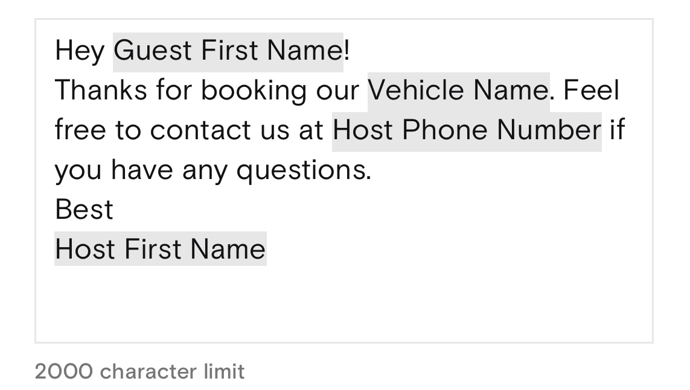

# TokenTextView
TokenTextView is a lightweight UITextView class for editing & managing tokenized text.

## Features
### Insert a token into the text


### Create templated or tokenized text



to:

>Hey {{GUEST_NAME}}!\nThanks for booking our {{VEHICLE_NAME}}. Feel free to contact us at {{HOST_PHONE_NUMBER}} if you have any questions.\nBest\n{{HOST_FIRST_NAME}}

and vice-versa.

### Cut/copy & paste tokens


## Requirements
- iOS 11.0+
- Xcode 14.0+

## Installation
TokenUI can be installed via [CocoaPods](https://cocoapods.org)

### CocoaPods
Add the following line to your Podfile:

```
pod 'TokenTextView'
```

Then install TokenTextView:

```
pod install
```


## Setup

### init
TokenTextView is a subclass of ``UITextView``, so you can declare it like a normal `UIKit` object in either code or via Storyboard:

```
let tokenTextView = TokenTextView()
```
or 

```
@IBOutlet var tokenTextView: TokenTextView!
```

TokenTextView has of the following initializer:

```
init(messageText: String, tokens: [Token], tokenOpen: String, tokenClose: String)
```

TokenTextView needs to be initialized with `Token` objects before it can tokenize text. You can do this during object initialization or set them later:

```
let tokenArray = [Token]()
let tokenTextView = TokenTextView(tokens: tokenArray)
```
or

```
let tokenTextView = TokenTextView()
let tokenArray = [Token]()

tokenTextView.tokens = tokenArray
```

TokenTextView can turn tokenized text into text templates and vice-versa. In order to do so, it uses identifiers to designate tokens. It's set up to use "mustache" syntax as the default:

>{{{TOKEN_IDENTIFIER}}}

You can use custom identifiers by passing in ``tokenOpen`` and ``tokenClose`` parameters during initialization:

```
let tokenTextView = TokenTextView(tokenOpen: "{{", tokenClose: "}}")
```


## Usage

### Insert a token
You can insert a token to TokenTextView's text by using the following method:

```
insert(_ token: Token, at insertRange: NSRange? = nil)
```
You can specify the location to insert the token:

```
let token = Token(name: "Token name", identifier: "TOKEN_IDENTIFIER")
let range = NSRange(location: 0, length: 0)

tokenTextView.insert(token, at: range)
```

Or you can leave the location blank, and the current location will be used:

```
let token = Token(name: "Token name", identifier: "TOKEN_IDENTIFIER")

tokenTextView.insert(token)
```

### Create templated text
TokenTextView has a computed property called `templatedText` that converts tokenized text into text templates with tokens in identifiers:

```
print(tokenTextView.templatedText)
```
will print:

>This is an example templated message. Some variables can be {{START_TIME}} and {{END_TIME}} or {{NAME}} and {{BIRTHDATE}}


### Create tokenized text
```
tokenTextView.text = "Hey {{GUEST_NAME}}!\nThanks for booking our {{VEHICLE_NAME}}. Feel free to contact us at {{HOST_PHONE_NUMBER}} if you have any questions.\nBest\n{{HOST_FIRST_NAME}}"
```
to


## Contributions

Please see [here](https://github.com/open-turo/contributions) for guidelines on how to contribute to this project.

## License

TokenTextView is released under the MIT License. See [LICENSE.md](LICENSE.md) for details
